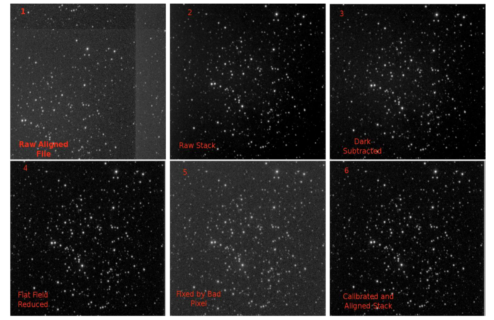

## researching the interstellar dust 

 

 

### tl; dr

* the study of intermediate-age open  clusters can be used to learn about the stellar evolution of  intermediate-mass stars and the dynamical evolution of clusters together with their interstellar extinction
* the interstellar extinction is a sum of absorption and scattering of the light within the interstellar medium,  being inversely proportional to the light wavelength
* consequently, a general increase in absorption toward shorter wavelengths is observed, resulting in the effect of reddening
* in this repository, i made available the source code for data reduction and analysis in IDL, and my report and results, as well
* **[here is the final report for this work](Interstellar_Extinction.pdf)**
